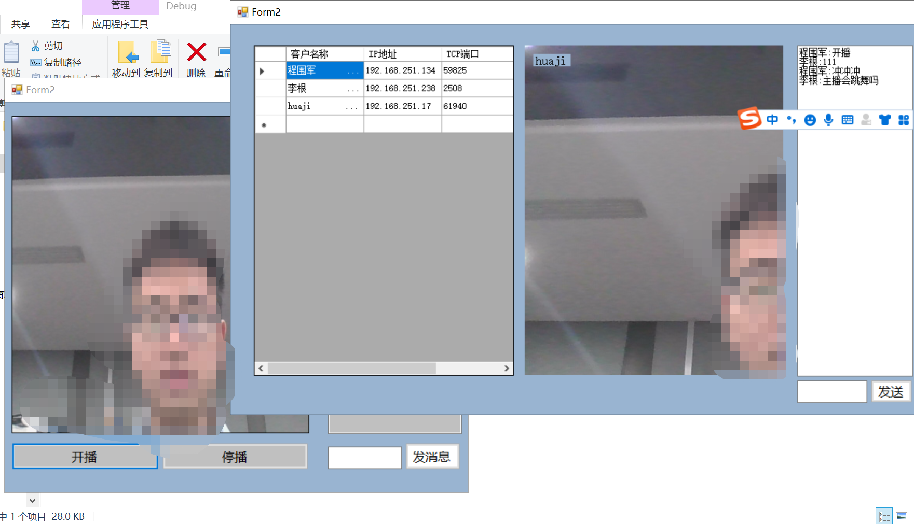
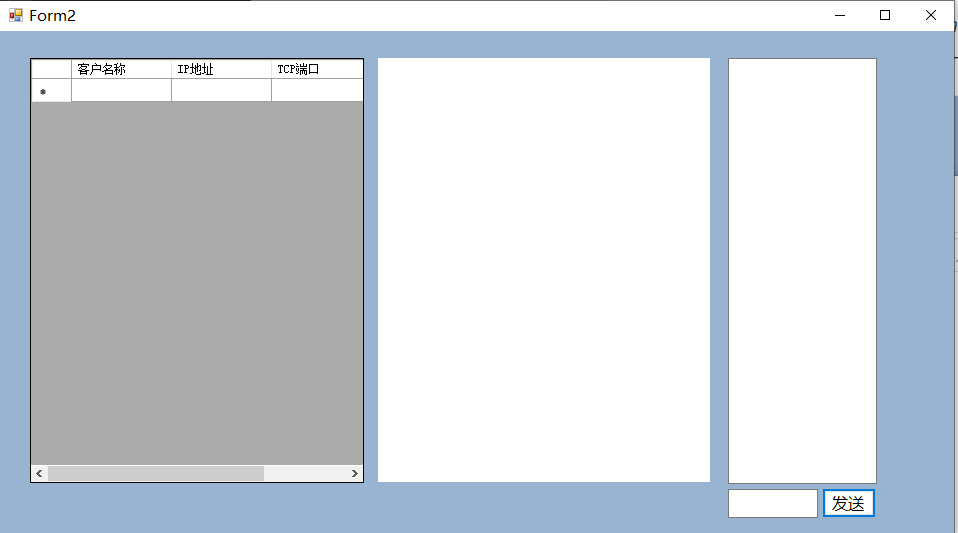
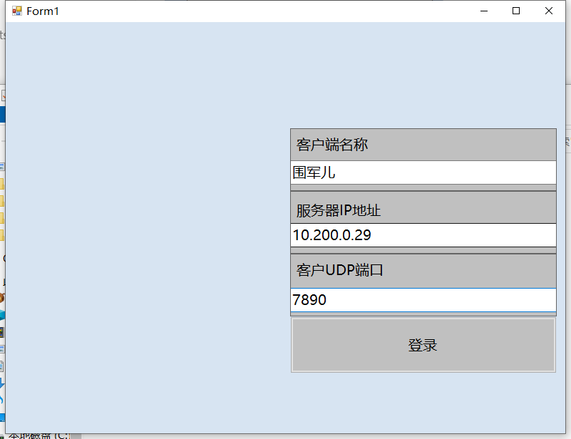
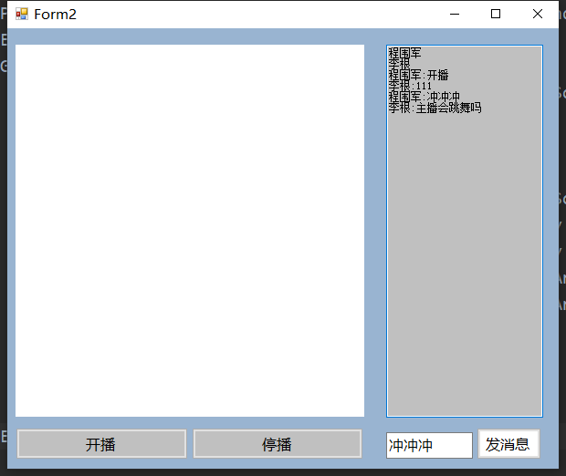
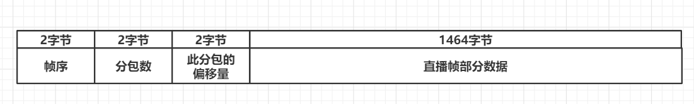

# 基于自定义TCP和UDP数据包实现的直播间

​	此项目是计算机网络课程的结课项目（得分A+），分为客户端client和服务器端server，使用**C#**完成，完全基于TCP和UDP实现，这些报文使用的协议被命名为：CRP（Chatting Room Protocol）。顾名思义，立项初期只是想做一个局域网聊天室，但越做越起劲，最终成了简易版直播间。

## 使用方法

### 启动服务器

打开server程序包（解压后点击*WindowsFormsApplication1.exe*），点击开机即可启动服务器

启动后效果如下图：

### 启动客户端

打开client程序包（解压后点击*WindowsFormsApplication1.exe*），填写服务器的局域网IP地址，客户端名称和UDP地址可随意填写。

登录后效果如下：

### 开启直播

其中一个客户端点击**开播**，效果如下：

其他客户端的效果如下：

## CRP协议

CRP协议分为TCP控制报文和UDP视频帧报文，使用的是同样的报文头

### CRP报头

标识符是用于判断报文是否属于CRP协议
报文类型用于区分报文体的类型，报文类型见下表：

| 报文类型       | 值   | 描述                           |
| -------------- | ---- | ------------------------------ |
| 登录请求       | 0    |                                |
| 登录响应       | 128  |                                |
| 登出请求       | 4    |                                |
| 开播请求       | 1    |                                |
| 开播响应       | 129  |                                |
| 停播请求       | 5    |                                |
| 发送弹幕       | 2    | 客户端发给服务器的弹幕数据     |
| 接收弹幕       | 130  | 服务器广播给客户端的弹幕数据   |
| 发送直播帧数据 | 3    | 客户端发给服务器的直播帧数据   |
| 接收直播帧数据 | 131  | 服务器广播给客户端的直播帧数据 |

### TCP控制报文体

| 报文类型 | 报文体                          |
| -------- | ------------------------------- |
| 登录请求 | 2字节的UDP端口，n字节客户端名称 |
| 登录响应 | 1字节成功标志位，n字节失败信息  |
| 登出请求 | 无                              |
| 开播请求 | 无                              |
| 开播响应 | 1字节成功标志位，n字节失败信息  |
| 停播请求 | 无                              |
| 发送弹幕 | n字节弹幕                       |
| 接收弹幕 | n字节弹幕                       |

### UDP视频帧报文体

由于**以太网协议中每包数据限制长度为1500字节**，而直播的帧数据远远超出这个限制，因而**需要进行分包发送**，每包数据 1500字节 - 20字节IP头 - 8字节UDP头 - 2字节CRP头 - 6字节帧序分包偏移量 = 1464字节。

**帧序代表这包数据所在帧在直播流中的序号，分包数代表此帧共分多少包，此分包的偏移量代表当前数据在此帧中是第几包**

服务器或客户端，维护了一个当前帧序的标志，代表当前正在接收哪一帧数据，**低于此标志的数据包属于过期数据**，会被直接丢弃，**高于此标志位的数据包自会更新此标志，并将缓冲区的图像载入到picturebox中**，而**等于此标志位的数据包则会被拼接进缓冲区的图像中**，循环往复，以完成直播推流的效果